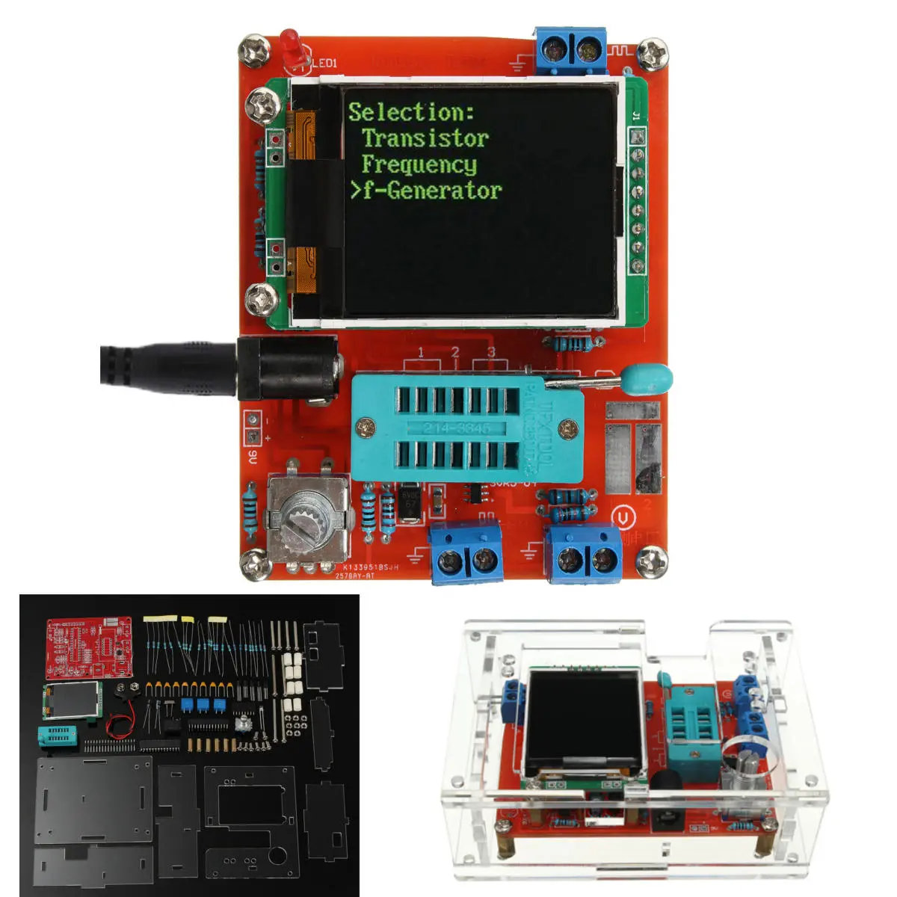

# transistor-tester

Documentation of my changes to the [AVR Transistortester](https://www.mikrocontroller.net/articles/AVR_Transistortester).

A transistor tester is a device where you can insert different kinds of electronic components and have them analyzed. It not only reads transistors and tells you whether it's NPN or PNP, but it tells you the resistance of resistors or capacitance of capacitors, and more. There are many different types, and they are usually very cheap. 

I have the [GM328 kit from Banggood](https://www.banggood.com/DIYAssembled-GM328-Transistor-Tester-Diode-Capacitance-LCR-Generator-With-Case-Kit-p-1163916.html?ID=530527&cur_warehouse=CN). It's usually called AY-AT instead, as it's not really a GM328.

Notable hardware:

* ATMEGA328P with 8MHz crystal
* ST7735 160x128px screen
* Rotary encoder
* 5.5mm x 2.1mm center positive barrel jack for 9V
* Terminals for frequency generator, frequency counter and voltage reader
* ZIF socket for analyzing components
* Holtek HT7550-1 voltage regulator
* WS TL431AA voltage reference

Firmware: 1.12k
